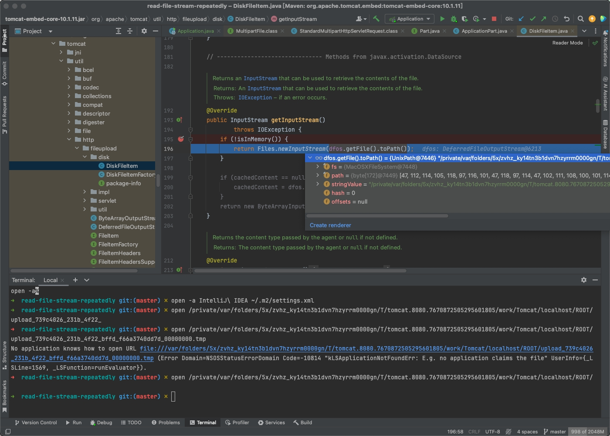
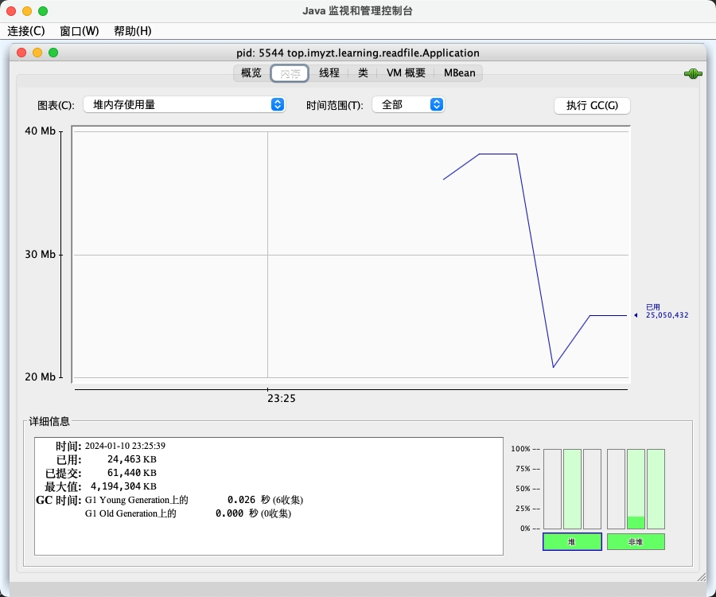
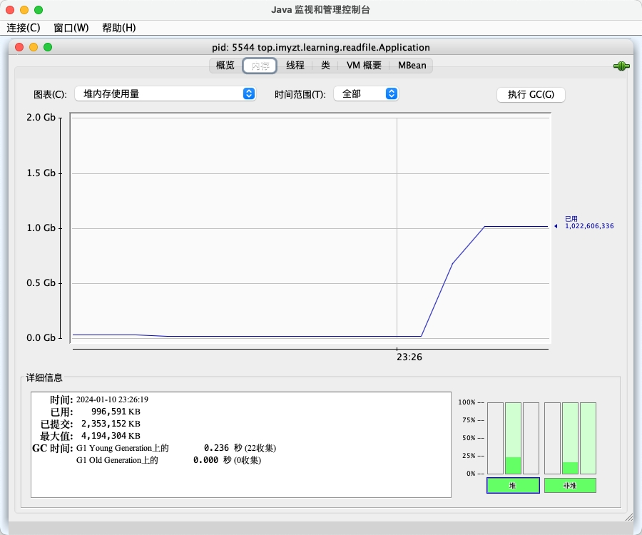
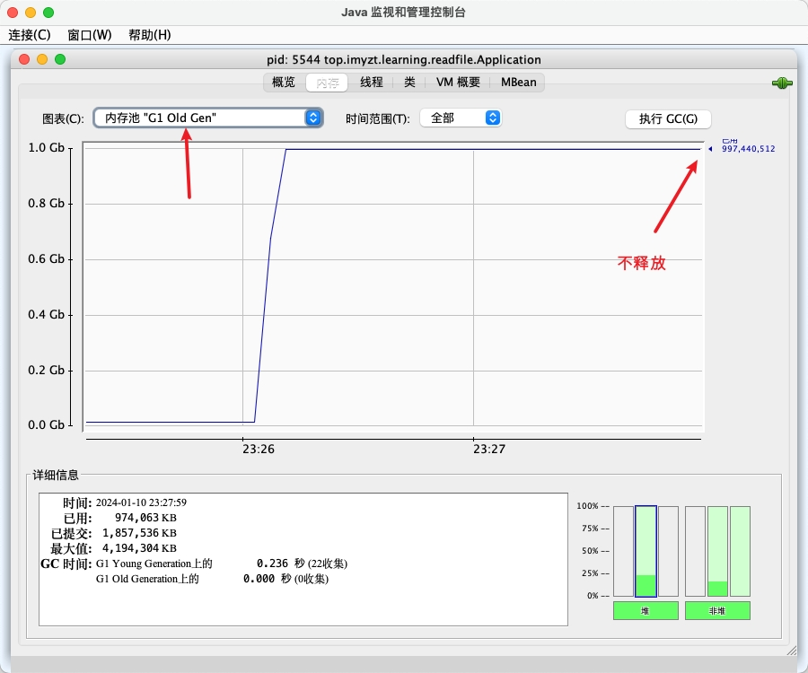

MultipartFile默认实现StandardMultipartFile，内部持有的对象Part. FileItem默认实现就是DiskFileItem，我们传的文件会默认保存到磁盘，当我们getInputStream时，会将内容读取到内存里。  
所以业务中有多个读取InputStream的地方,可以直接使用MultipartFile提供的方法,而不是直接getBytes.  
  

getInputStream:  
  

getBytes：  
  

占用老年代不释放:  
  
手动GC后, 空间终于释放  
  
