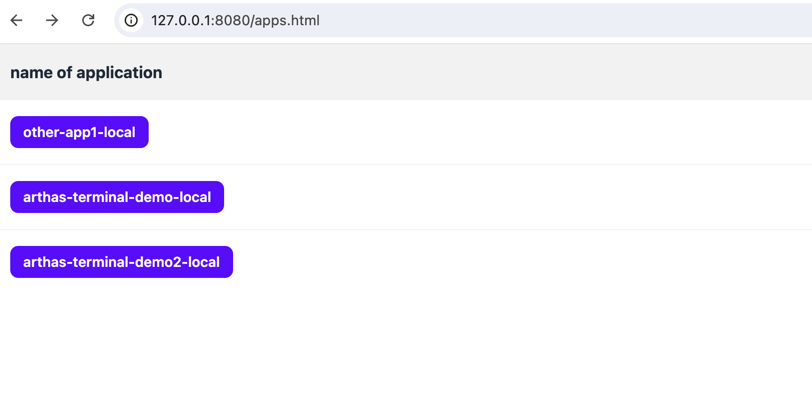
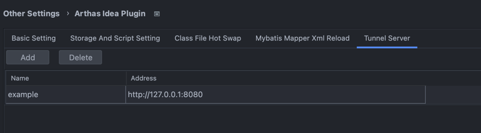
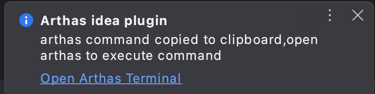
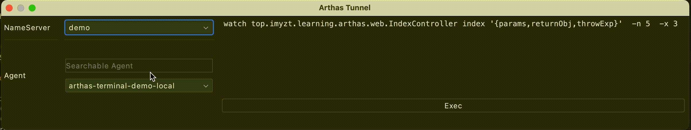
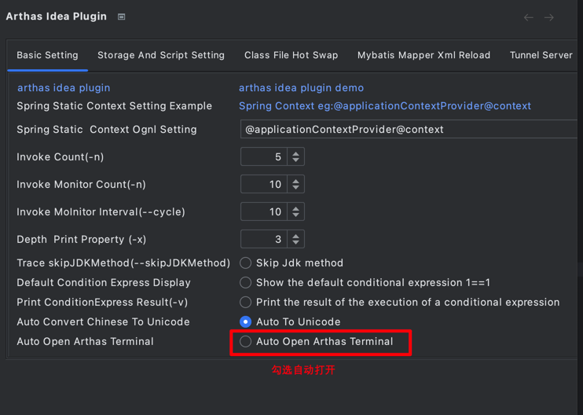
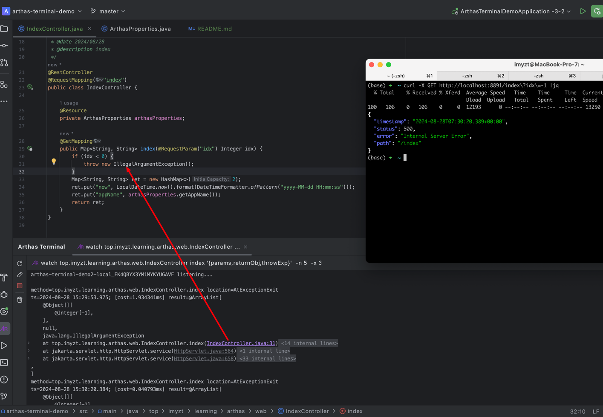

演示环境如下:  

1. 准备3个服务,并将其启动(即本项目),所有服务代码一致

| 服务名                   | 实例个数 |
|-----------------------|------|
| arthas-terminal-demo  | 1    |
| arthas-terminal-demo2 | 1    |
| other-app1            | 2    |

2. 启动`tunnel-server`服务, web端口`8080`, arthas agent端口`7777`

3. 配置 arthas-idea 插件

4. 正常拷贝命令，增加了Terminal选择按钮

5. 弹出选择窗口，选择对应的`NameServer（一般是不同环境）`与`Agent（应用）`，点击`Exec`，弹出`ToolWindow`展示Arthas的信息。

6. 可以选择拷贝命令后自动打开Terminal

7. 快速跳转至异常
